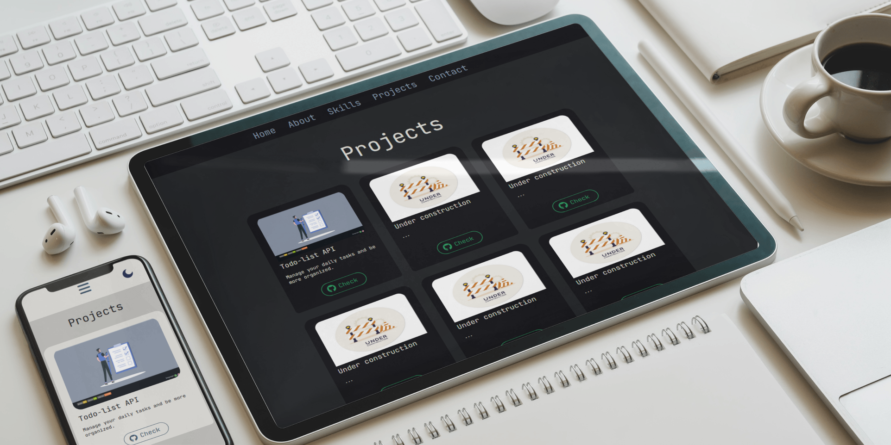
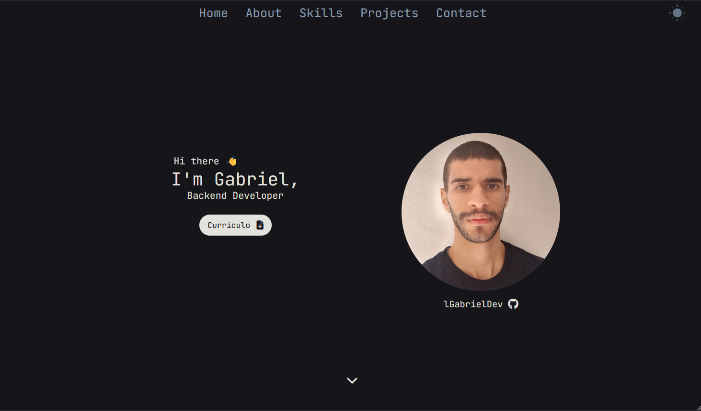
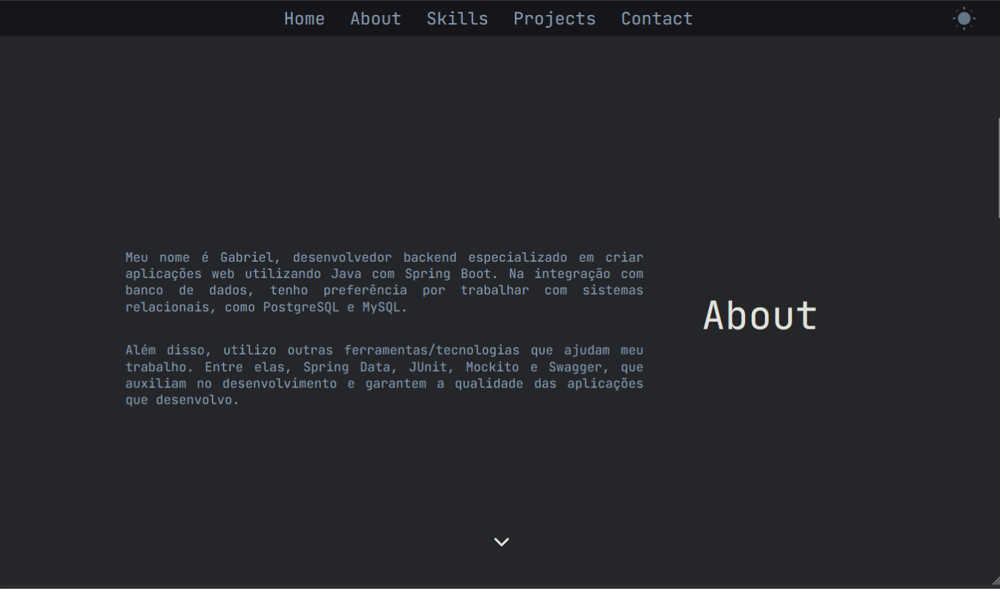
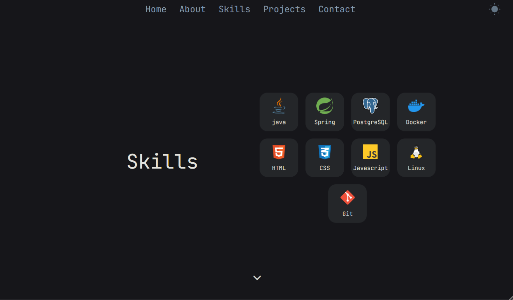
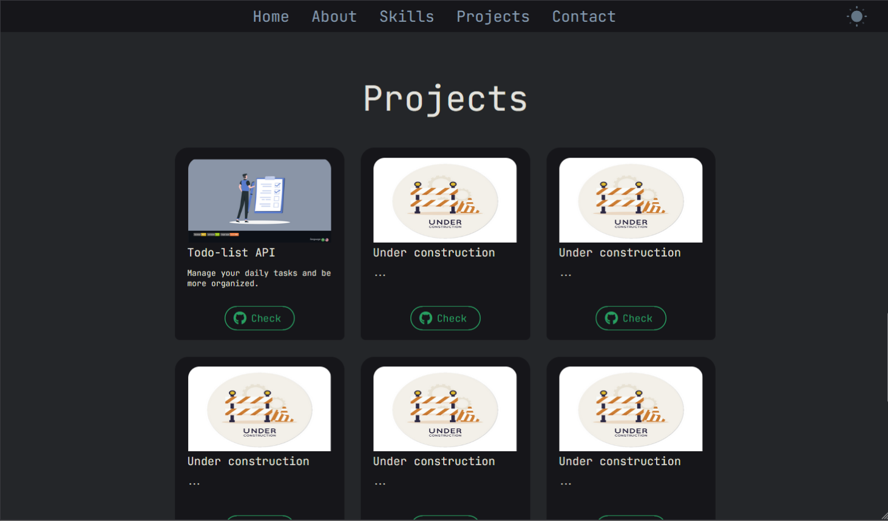
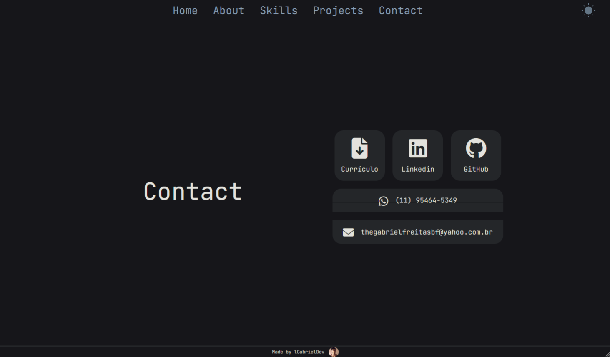
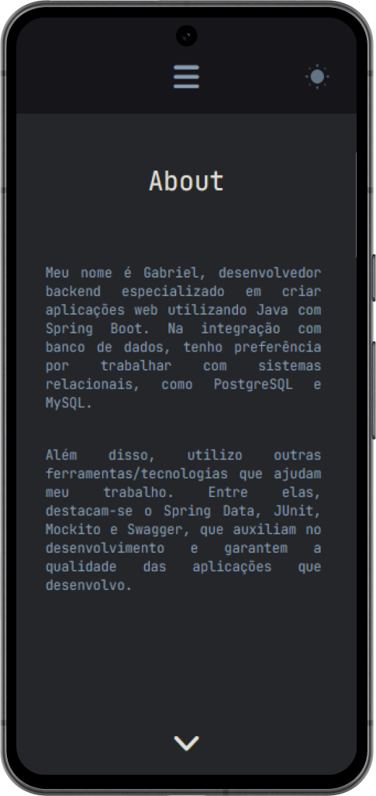
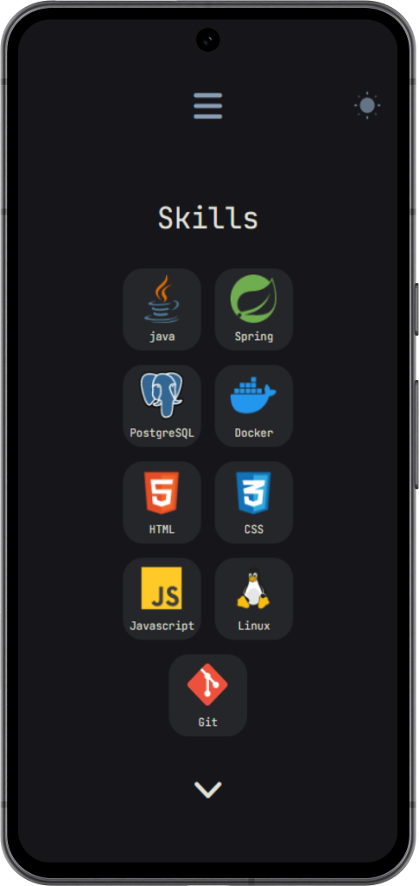
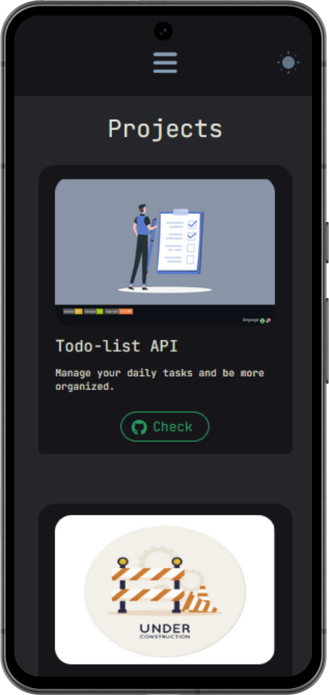
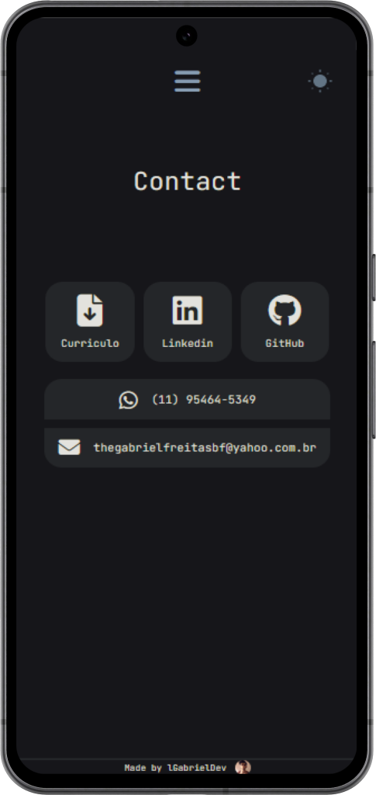

<!-- title -->
<h1 align="center">
    
Portfólio

    
</h1>

<!-- badges -->

    </img>
    </img>
    </img>

<!-- languages -->

    <!-- US -->
    
    <!-- BR -->
    

<!-- about -->
##  Sobre o projeto
Página web criada para agrupar meus projetos principais.

 

<!-- pictures -->
##  Screenshots

###  Desktop

    
     
       
    
     
     
    
     
     
    
     
     
    

 
 

###  Mobile

    
    
    
    
    

 

<!-- technologies -->
##  Tecnologias

 

<!-- run -->
##  Acesse aqui

Acesse aqui -> [lgabrieldev.github.io](https://lgabrieldev.github.io/)

 

<!-- Credits -->
<h2>
    
    Créditos
</h2>
As imagens e os ícones usados nesse projeto foram retirados dos seguntes websites: 

- [shields.io](https://shields.io/)
- [icon-icons](https://icon-icons.com/)
- [iconfinder](https://www.iconfinder.com/)
- [github skill/icons](https://github.com/tandpfun/skill-icons)
- [fontawesome](https://fontawesome.com/)
- [stodyset](https://storyset.com/)
- [svgrepo](https://www.svgrepo.com)
- [free pik](https://br.freepik.com/)

 

<!-- License -->
<h2>
    
    Licença
</h2>

Esse projeto está sob a licença [MIT](./LICENSE).

